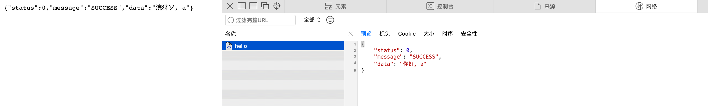
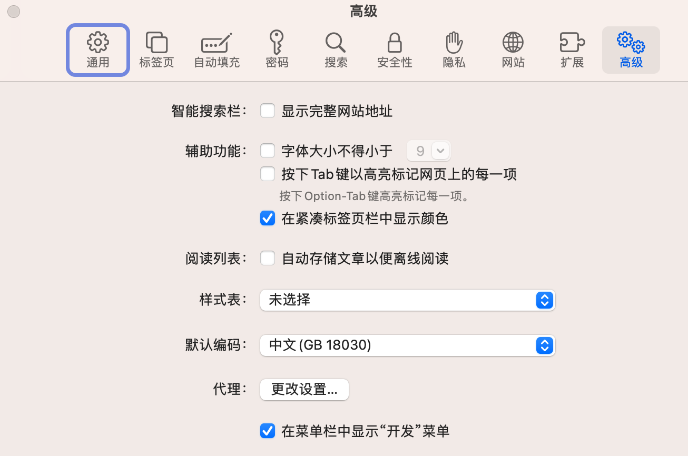

# Safari
## 1) Safari快捷键
https://www.macbl.com/article/tips/1862

| 功能             | 快捷键                   |
|----------------|-----------------------|
| 打开或者关闭阅读列表的侧边栏 | Command + Control + 2 |
| 添加到阅读列表        | 点击链接的时候按下Shift        |
| 将当前网页添加到阅读列表   | Command + Shift + D   |
| 切换到左侧标签        | Command + Shift + ⬅️  |
| 切换到右侧标签        | Command + Shift + ➡️  |

## 2) Safari接口返回中文乱码
### 问题

### 解决

将这里的编码由 GB18030 改为 UTF8