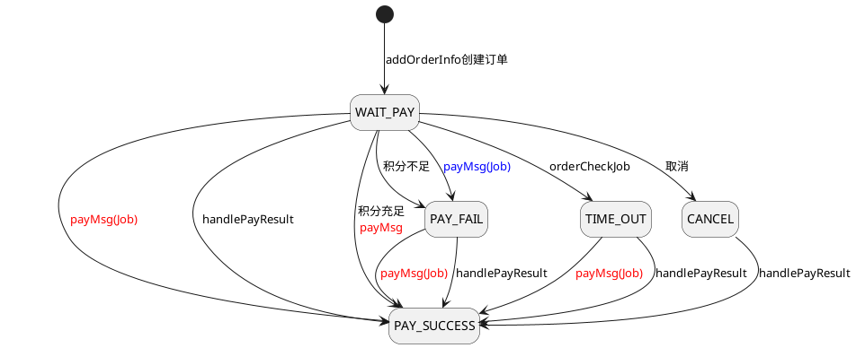
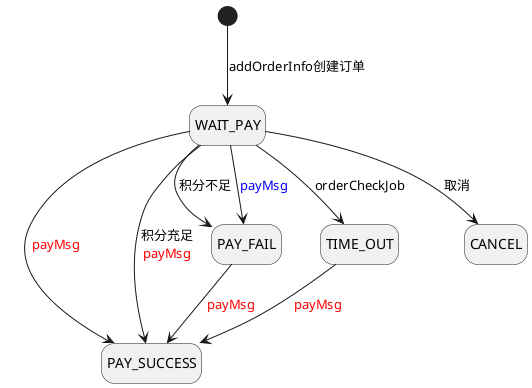

```plantuml
@startuml
hide empty description

WAIT_PAY --> PAY_FAIL :积分不足
WAIT_PAY --> PAY_FAIL :<font color="blue">payMsg(Job)</font>
WAIT_PAY --> PAY_SUCCESS :积分充足\n<font color="red">payMsg</font>
WAIT_PAY --> TIME_OUT :orderCheckJob
WAIT_PAY --> CANCEL :取消
[*] --> WAIT_PAY :addOrderInfo创建订单
WAIT_PAY -> PAY_SUCCESS :<font color="red">payMsg(Job)</font>
TIME_OUT --> PAY_SUCCESS :<font color="red">payMsg(Job)</font> 
PAY_FAIL --> PAY_SUCCESS :<font color="red">payMsg(Job)</font>

WAIT_PAY -> PAY_SUCCESS :handlePayResult
TIME_OUT --> PAY_SUCCESS :handlePayResult 
PAY_FAIL --> PAY_SUCCESS :handlePayResult 
CANCEL --> PAY_SUCCESS :handlePayResult
@enduml
```

```plantuml
@startuml
hide empty description

WAIT_PAY --> PAY_FAIL :积分不足
WAIT_PAY --> PAY_FAIL :<font color="blue">payMsg</font>
WAIT_PAY --> PAY_SUCCESS :积分充足\n<font color="red">payMsg</font>
WAIT_PAY --> TIME_OUT :orderCheckJob
WAIT_PAY --> CANCEL :取消
[*] --> WAIT_PAY :addOrderInfo创建订单
WAIT_PAY -> PAY_SUCCESS :<font color="red">payMsg</font>
TIME_OUT --> PAY_SUCCESS :<font color="red">payMsg</font> 
PAY_FAIL --> PAY_SUCCESS :<font color="red">payMsg</font>
@enduml
```