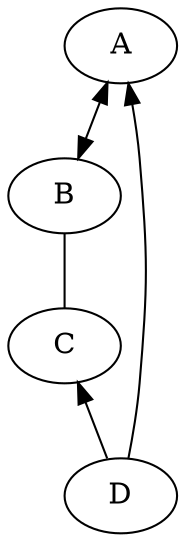
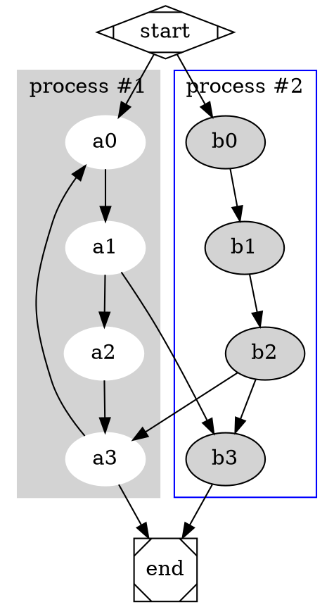

# graphviz
https://graphviz.org/
在线： https://dreampuf.github.io/GraphvizOnline/

## 基础指向
```
digraph demo{
    A->B[dir=both];
    B->C[dir=none];
    C->D[dir=back];
    D->A[dir=forward];
}
```


```
digraph G {

  subgraph cluster_0 {
    style=filled;
    color=lightgrey;
    node [style=filled,color=white];
    a0 -> a1 -> a2 -> a3;
    label = "process #1";
  }

  subgraph cluster_1 {
    node [style=filled];
    b0 -> b1 -> b2 -> b3;
    label = "process #2";
    color=blue
  }
  start -> a0;
  start -> b0;
  a1 -> b3;
  b2 -> a3;
  a3 -> a0;
  a3 -> end;
  b3 -> end;

  start [shape=Mdiamond];
  end [shape=Msquare];
}
```

