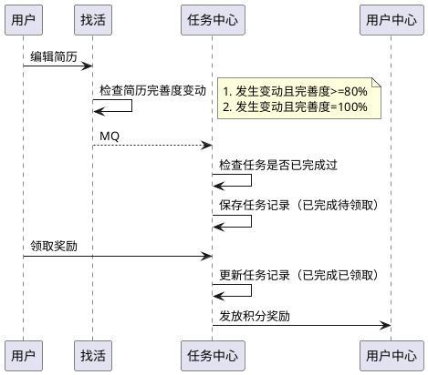
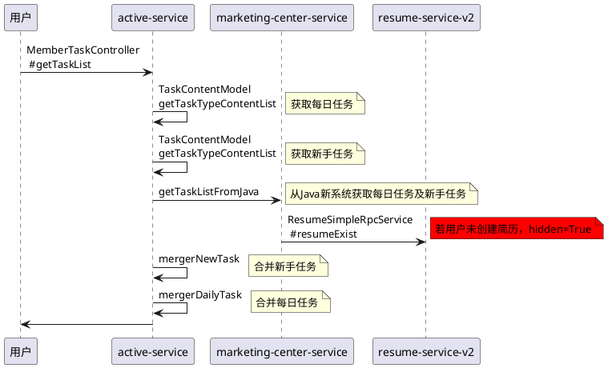
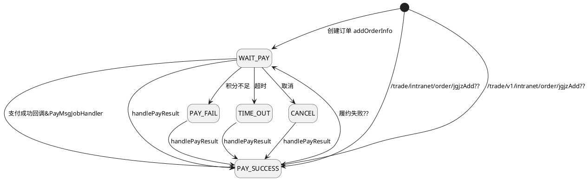

```plantuml
@startuml
用户 -> 找活:编辑简历
找活 -> 找活:检查简历完善度变动
note right
    1. 发生变动且完善度>=80%
    2. 发生变动且完善度=100%
end note
找活 --> 任务中心: MQ
任务中心 -> 任务中心:检查任务是否已完成过
任务中心 -> 任务中心:保存任务记录（已完成待领取）
用户 -> 任务中心:领取奖励
任务中心 -> 任务中心:更新任务记录（已完成已领取）
任务中心 -> 用户中心:发放积分奖励
@enduml
```

```plantuml
@startuml
用户 -> "active-service":MemberTaskController\n #getTaskList
"active-service" -> "active-service":TaskContentModel\ngetTaskTypeContentList
note right:获取每日任务
"active-service" -> "active-service":TaskContentModel\ngetTaskTypeContentList
note right:获取新手任务
"active-service" -> "marketing-center-service":getTaskListFromJava
note right: 从Java新系统获取每日任务及新手任务
"marketing-center-service" -> "resume-service-v2":ResumeSimpleRpcService\n #resumeExist
note right#red:若用户未创建简历，hidden=True
"active-service" -> "active-service":mergerNewTask
note right:合并新手任务
"active-service" -> "active-service":mergerDailyTask
note right:合并每日任务
"active-service" -> "用户"
@enduml
```

```plantuml
@startuml
hide empty description
[*] --> WAIT_PAY :创建订单 addOrderInfo
WAIT_PAY -> PAY_SUCCESS :支付成功回调&PayMsgJobHandler
[*] -> PAY_SUCCESS :/trade/intranet/order/jgjzAdd??
[*] -> PAY_SUCCESS :/trade/v1/intranet/order/jgjzAdd??
PAY_SUCCESS -> WAIT_PAY :履约失败??
WAIT_PAY --> PAY_FAIL :积分不足
WAIT_PAY --> TIME_OUT :超时
WAIT_PAY --> CANCEL :取消
CANCEL --> PAY_SUCCESS :handlePayResult
WAIT_PAY --> PAY_SUCCESS :handlePayResult
TIME_OUT --> PAY_SUCCESS :handlePayResult
PAY_FAIL --> PAY_SUCCESS :handlePayResult
@enduml
```

/trade/v1/promise/resetOrderResult  重置订单真实支付状态