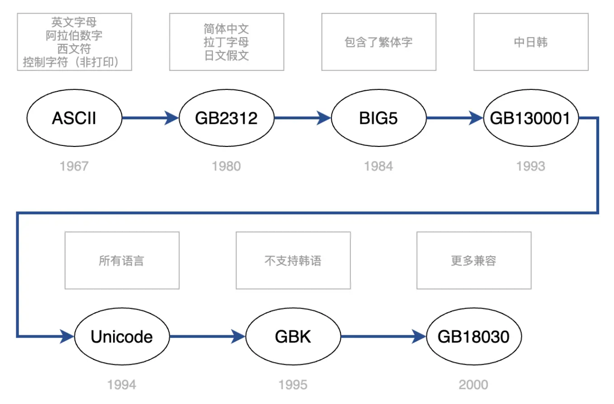

# 字符集
## ASCII
最早的字符集。由于计算机是美国人发明的，只要支持26个英文字母，加上一些特殊符号，所以1个字节完全够了。
也有人将 ASCII 编码分成两部分：
前 128 个字符称为基本 ASCII，包含常见字符；
后 128 个字符称为扩展 ASCII，包含一些特殊字符。

## 中文字符集


## Unicode和UTF-8有什么区别
Unicode 是一种编码方案，使用数字来表示世界上所有的字符和符号，每个字符都有一个唯一的编号，称为Unicode码点或码位，但是却没有规定如何存储。
而UTF-8是Unicode的一种实现方式，可以在计算机上存储和传输Unicode字符的编码方式（其中UTF代表：Unicode Transformation Formats）。

## Unicode
Unicode编码范围是从U+0000到U+10FFFF，定义了17个平面，每个平面包含65,536个码位，共计 1,114,112 个码位。（从这里来看3字节就够了）  
Unicode编码方案使用数字来表示世界上所有的字符和符号，每个字符都有一个唯一的编号，称为Unicode码点或码位。  
Unicode编码也在不断地扩展，2022年9月发布的15.0版本收录了 149,186 个字符。

第一个平面（Plane 0，也称为基本多文种平面（Basic Multilingual Plane，BMP））包含了大部分常用的字符和符号，包括ASCII字符集和大部分欧洲语言中的字符。  
其他平面包含了一些罕见的字符和符号，例如古文字、符号和表情符号等。

Unicode编码范围是非常广泛的，涵盖了世界上所有的字符和符号，包括各种语言的字符、标点符号、数学符号、货币符号、表情符号等。
这使得Unicode编码方案成为了全球范围内标准的字符集编码方案。

## UCS-2
使用16位的编码空间。也就是每个字符占用2个字节。这样理论上一共最多可以表示 65536 个字符，能够覆盖 ISO 10646 定义的能用字符集，基本满足各种语言的使用。
很多浏览器只能显示UCS-2完整字符集。

## UTF-32
Unicode的一种实现，统一使用4个字节来存储。UTF-32中的每个32位值代表一个Unicode码位，并且与该码位的数值完全一致。

## UTF-8
Unicode的一种实现，通过开头的标志位位数实现了变长。占用 1-4 个字节，对于单字节字符，只占用一个字节，实现了向下兼容 ASCII。
```
U+ 0000 ~ U+ 007F: 0XXXXXXX
U+ 0080 ~ U+ 07FF: 110XXXXX 10XXXXXX
U+ 0800 ~ U+ FFFF: 1110XXXX 10XXXXXX 10XXXXXX
U+10000 ~ U+1FFFF: 11110XXX 10XXXXXX 10XXXXXX 10XXXXXX
```
这里最多 2,097,152 个字符，足够用了。

```
UTF-8使用一至六个字节为每个字符编码
（尽管如此，2003年11月UTF-8被RFC 3629重新规范，只能使用原来Unicode定义的区域，U+0000到U+10FFFF，也就是说最多四个字节）
```

## utf8mb4
utf8mb4只是mysql特有的概念，原因是mysql在5.5.3之前，Unicode收录的字符还不是很多，（最大）3个字节足够存储，所以那时的mysql把utf8（alias of "utf8mb3"）存储也设计为3字节存储。后来Unicode收录的字符更多了，扩张到4字节了（比如表情😁）。

MySQL也在5.5.3版本之后增加了这个utf8mb4的编码，mb4就是most bytes 4的意思，专门用来兼容四字节的Unicode。

参考:  
https://dev.mysql.com/doc/refman/8.0/en/charset-unicode-utf8mb3.html  
https://dev.mysql.com/doc/refman/8.0/en/charset-unicode-utf8mb4.html


